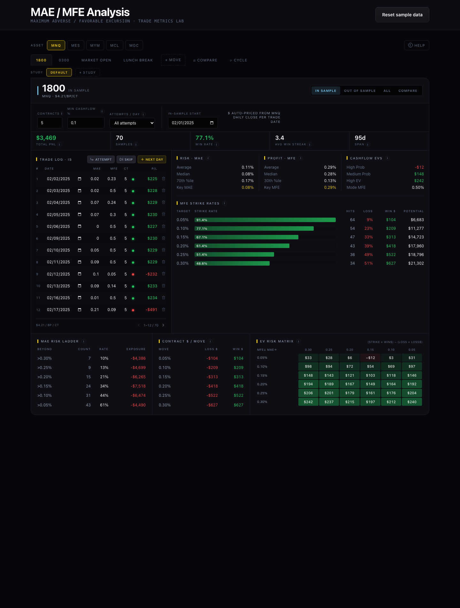

# MAE / MFE Analysis Dashboard

A standalone, browser-based dashboard for analyzing **Maximum Adverse Excursion
(MAE)** and **Maximum Favorable Excursion (MFE)** across futures trades — a
multi-asset trade-metrics lab with in-sample / out-of-sample comparison, an
expected-value risk matrix, strike-rate ladders, and portfolio cycling.

It was extracted **1:1** from a larger trading-education platform, where it ran
as an in-app assignment wired to a backend and login. This repo is the same
dashboard, lifted out to run entirely on your own machine — bundled price data,
all math in the browser, and a tiny optional database for saving your work.



---

## Table of contents

- [What it does](#what-it-does)
- [The concepts (MAE / MFE in 60 seconds)](#the-concepts-mae--mfe-in-60-seconds)
- [Requirements](#requirements)
- [Install](#install)
- [Start it](#start-it)
- [How persistence works](#how-persistence-works)
- [Using the dashboard](#using-the-dashboard)
- [How it works under the hood](#how-it-works-under-the-hood)
- [Project structure](#project-structure)
- [Scripts](#scripts)
- [Storage API reference](#storage-api-reference)
- [Production build](#production-build)
- [Troubleshooting](#troubleshooting)
- [Tech stack](#tech-stack)

---

## What it does

- **Multi-asset** — MNQ / MES / MYM / MCL / MGC, each with its own contract spec
  (point value, tick size) and bundled daily closes so trades are auto-priced to
  dollars.
- **Moves** — built-in "gunship" moves (1800 / 0300 / Market Open / Lunch Break),
  each with its own trading-day calendar. You can add custom moves and named
  studies.
- **Datasets per move** — an **In-Sample** ledger plus up to three
  **Out-of-Sample** windows, each an editable table of date / MAE% / MFE% /
  contracts.
- **Live analytics** — strike-rate ladders against MAE/MFE thresholds, an
  expected-value (EV) risk matrix, win rate, average win streak, and cashflow
  bands — all recomputed instantly as you edit.
- **Compare & combine** — In-Sample vs. an Out-of-Sample window side by side,
  cross-asset combination, and a portfolio-cycling simulation that rotates
  trades across accounts.

---

## The concepts (MAE / MFE in 60 seconds)

- **MAE — Maximum Adverse Excursion:** the worst drawdown a trade reached before
  it closed (how far it went *against* you).
- **MFE — Maximum Favorable Excursion:** the best unrealized gain a trade reached
  (how far it went *for* you).

By logging MAE and MFE for many trades you can answer questions like *"if I'd set
my stop at 0.15 and my target at 0.30, how many trades would have survived, and
what's the expected value?"* The dashboard does that math across thresholds and
shows it as strike-rate ladders and an EV matrix. **In-Sample** is the data you
designed the rule on; **Out-of-Sample** is fresh data you test it against to
check the edge holds up.

---

## Requirements

- **Node.js 22.5 or newer** (Node 24+ recommended). The storage backend uses
  Node's built-in SQLite module (`node:sqlite`), which only exists in 22.5+.
  Check yours with `node -v`.
- **npm** (ships with Node).
- A modern browser.

No database server, no Docker, no global installs — everything is local.

---

## Install

```bash
git clone https://github.com/thedailyprofiler/mae-mfe-dashboard.git
cd mae-mfe-dashboard
npm install
```

---

## Start it

There are two ways to run it. Pick based on whether you want your data saved to
a real database file.

### Option A — full app with SQLite storage (recommended)

Runs the storage backend **and** the web app together:

```bash
npm run dev:full
```

Then open **http://localhost:5185**. Your data is saved to a local database file
(`server/data/mae-mfe.db`). The header shows a **SQLite** badge.

You'll see colour-tagged output from both processes:

```
[api]  MAE/MFE storage → http://localhost:8787  (db: server/data/mae-mfe.db)
[web]  ➜  Local:   http://localhost:5185/
```

Press **Ctrl-C** once to stop both.

### Option B — web app only (no backend)

```bash
npm run dev
```

Open **http://localhost:5185**. There's no database here, so your work is saved
to the browser's **localStorage** instead (the header shows a **Local** badge).
This is the zero-setup option — handy for a quick look — but data lives only in
that one browser.

> **Either way the app works.** Even in Option A, if the backend isn't reachable
> the app automatically falls back to localStorage. You never lose the ability to
> use it.

---

## How persistence works

Persistence is deliberately tiny and has **zero npm dependencies**.

```
┌─────────────┐   saves/loads    ┌──────────────────┐   reads/writes   ┌───────────────────────┐
│  Dashboard  │ ───────────────▶ │  src/storage.ts  │ ───────────────▶ │  SQLite backend       │
│  (React)    │                  │                  │                  │  server/index.mjs     │
└─────────────┘                  └──────────────────┘                  │  → server/data/*.db   │
                                        │  fallback                     └───────────────────────┘
                                        ▼
                                 ┌──────────────────┐
                                 │  localStorage    │
                                 └──────────────────┘
```

- The entire dashboard is stored as **one JSON document** — the same schemaless
  "blob" model the production app uses. One row per *profile* (defaults to
  `default`).
- **`src/storage.ts`** tries the SQLite backend first. If it can't reach it
  (e.g. you ran Option B), it transparently uses **localStorage**. Every save to
  SQLite is *also* mirrored to localStorage as a durability safeguard.
- The **badge in the header** (SQLite / Local) always tells you where your data
  is currently going — it's never a mystery.
- Saves are **debounced** (~600ms after you stop typing), so rapid edits don't
  hammer the disk.
- The database is a single file at **`server/data/mae-mfe.db`**. To back up your
  work, copy that file. To start fresh, delete it (or use **Clear data** in the
  app). It is git-ignored, so your data never gets committed.

### Clearing data

The **Clear data** button (top-right) wipes everything for the current profile —
moves, studies, and trades — from both SQLite and localStorage. It asks for
confirmation first (*"Are you sure you want to wipe the whole database?"*) and
cannot be undone.

---

## Using the dashboard

1. **Pick an asset** — the `MNQ / MES / MYM / MCL / MGC` row at the top. Each
   asset keeps its own independent data and is priced with its own contract spec.
2. **Pick a move** — the tabs below (`1800 / 0300 / Market Open / Lunch Break`).
   Use **+ Move** to add a custom move, and **+ Study** to add a named study
   overlay.
3. **Choose a sample** — the segmented control on the right of the move header:
   - **In Sample** — your design dataset.
   - **Out of Sample** — three independent test windows.
   - **All** — everything together.
   - **Compare** — In-Sample vs. an Out-of-Sample window, side by side.
4. **Log trades** — in the **Trade Log** table, enter the trade date, **MAE%**,
   **MFE%**, and **contracts**. Use **+ Next Day** to advance along the move's
   trading calendar, **Attempt** to add a row, **Skip** to skip a day.
5. **Read the analytics** — as soon as you log a trade, the panels light up:
   Total P/L, sample count, win rate, average win streak, MAE/MFE strike-rate
   ladders, and the EV risk matrix. P/L is auto-priced from the asset's bundled
   daily closes for each trade date (or set a reference price manually).
6. **Compare / Combine / Cycle** — the **Compare** and **Cycle** tabs at the top
   open cross-dataset and cross-asset views, including a portfolio-cycling
   simulation.

Everything autosaves. Reload the page and it's exactly where you left off.

---

## How it works under the hood

- **Everything runs client-side.** Daily price data for all five assets
  (2019–2026) is bundled into the app (`src/lib/mnqPrices.ts`,
  `src/lib/assetPrices.ts`). There are **no external API calls** — the only
  network traffic is saving/loading your document to the local SQLite backend.
- **One document, one reducer.** State is a single `MaeMfeDocument`: one
  `MaeMfeState` per asset → one `MoveState` per move → each holding the
  In-Sample + Out-of-Sample ledgers. All edits go through a reducer in
  `src/components/assignments/mae-mfe/maeMfeDocument.ts`.
- **Forward-compatible storage.** On load, `hydrateDocument()` migrates older
  document shapes to the current one (e.g. folding a legacy single-asset blob
  under MNQ), so saved data survives schema changes.
- **Pure math, separately tested.** All the statistics — `deriveRow`,
  `computeDatasetDashboard`, the EV math, combine/cycle logic — live in `src/lib`
  as pure functions with their own unit tests (`npm test`, 112 tests).
- **The UI is untouched from the source.** The dashboard components were copied
  byte-for-byte from the production app; only the wrapper (login + backend
  autosave) was replaced with the local `storage.ts` layer.

---

## Project structure

```
mae-mfe-dashboard/
├── server/
│   └── index.mjs                        # zero-dep SQLite backend (node:http + node:sqlite)
├── scripts/
│   └── dev-full.mjs                     # runs the backend + Vite together (no deps)
├── src/
│   ├── main.tsx                         # React entry point
│   ├── App.tsx                          # app shell: loads empty, wires persistence, header + Clear data
│   ├── storage.ts                       # SQLite-first persistence with localStorage fallback
│   ├── index.css                        # full design system (Tailwind 4 @theme tokens)
│   ├── components/assignments/mae-mfe/  # the dashboard UI (carried verbatim from source)
│   │   ├── MaeMfeAnalysisView.tsx       #   root: asset switcher + move tabs + persistence props
│   │   ├── MoveDashboard.tsx            #   one (asset, move): sample tabs, toolbar, table, analytics
│   │   ├── DatasetDashboard.tsx         #   strike-rate ladders, EV matrix, stat bands
│   │   ├── ComparePanel / CombineComparePanel / CyclingPanel
│   │   ├── RowTable.tsx · NumericInput.tsx   #   the editable trade ledger
│   │   ├── HelpPanel.tsx · InfoTip.tsx · helpContent.ts
│   │   ├── maeMfeDocument.ts            #   state model + reducer + migration (hydrateDocument)
│   │   └── __tests__/                   #   document + action tests
│   └── lib/                             # pure logic + data (carried verbatim)
│       ├── maeMfeStats.ts               #   stats engine: deriveRow, computeDatasetDashboard, $ math
│       ├── maeMfeCombine.ts             #   cross-asset combine + portfolio cycling
│       ├── assets.ts · moveRegistry.ts · tradingCalendar.ts
│       ├── mnqPrices.ts · assetPrices.ts     #   bundled daily closes (2019–2026)
│       └── __tests__/                   #   stats / combine / cycle tests
├── index.html
├── vite.config.ts                       # dev + preview server, /api proxy → :8787
├── jest.config.mjs · jest.setup.ts      # test runner config
└── package.json
```

---

## Scripts

| Command | What it does |
|---|---|
| `npm run dev:full` | **Start everything** — SQLite backend **+** web app together |
| `npm run dev` | Web app only (saves to localStorage) |
| `npm run server` | SQLite backend only, on port `8787` |
| `npm run build` | Production build → `dist/` |
| `npm run preview` | Serve the production build (also proxies `/api`) |
| `npm run typecheck` | `tsc --noEmit` over the app |
| `npm test` | Run the Jest unit suite (stats, document migration, combine/cycle) |

**Ports:** web app `5185`, storage backend `8787`. Override the backend the app
talks to with `VITE_API_TARGET`, or change the backend's own port with `PORT`:

```bash
PORT=9000 VITE_API_TARGET=http://localhost:9000 npm run dev:full
```

---

## Storage API reference

The backend (`server/index.mjs`) exposes a tiny REST API. In dev, the web app
reaches it through the `/api` proxy, so you rarely call it directly — but it's
plain HTTP if you want to script backups or integrations.

| Method | Route | Body | Response |
|---|---|---|---|
| `GET` | `/api/doc?profile=default` | — | `{ doc, updatedAt }` — `doc` is `null` if nothing saved yet |
| `PUT` | `/api/doc?profile=default` | `{ doc }` | `{ ok: true, updatedAt }` — upserts the whole document |
| `DELETE` | `/api/doc?profile=default` | — | `{ ok: true }` — wipes that profile |
| `GET` | `/api/health` | — | `{ ok: true }` |

The `profile` query param lets you keep multiple independent saves (e.g.
`?profile=experiment-1`); it defaults to `default`.

Example — back up the default profile to a file:

```bash
curl -s "http://localhost:8787/api/doc?profile=default" > backup.json
```

Restore it:

```bash
curl -X PUT "http://localhost:8787/api/doc?profile=default" \
  -H "Content-Type: application/json" \
  --data-binary @backup.json
```

---

## Production build

```bash
npm run build      # outputs static files to dist/
npm run server     # in another terminal: start the SQLite backend
npm run preview    # serve dist/ on :5185, proxying /api → :8787
```

`dist/` is a static bundle you can host on any static host (Netlify, S3, nginx,
etc.). If you deploy the frontend separately from the backend, point the app at
your backend by building with `VITE_API_TARGET` set, or front both behind a
reverse proxy that routes `/api` to the storage server. With no backend reachable,
the app still runs fully on localStorage.

---

## Troubleshooting

**`node-v` shows < 22.5 / `Cannot find module 'node:sqlite'`**
Upgrade Node to 22.5+ (24+ recommended). The backend needs the built-in SQLite
module. Option B (`npm run dev`, localStorage) works on older Node.

**`ExperimentalWarning: SQLite is an experimental feature`**
Harmless — `node:sqlite` is stable enough to use but Node flags it as
experimental. The `server` script already silences it with
`--disable-warning=ExperimentalWarning`.

**Port 5185 or 8787 already in use**
Something else is running. Stop it, or change ports: set `PORT` for the backend
and `VITE_API_TARGET` to match (see [Scripts](#scripts)). The web port is set in
`vite.config.ts`.

**Header badge says "Local" when I expected "SQLite"**
The web app couldn't reach the backend. Make sure you started it with
`npm run dev:full` (not `npm run dev`), and that the `[api]` line appeared in the
output. Your data is safe — it's in localStorage and will sync to SQLite once the
backend is reachable on the next save.

**I want to wipe everything**
Click **Clear data** in the app, or delete `server/data/mae-mfe.db` while the
server is stopped.

---

## Tech stack

React 19 · TypeScript · Vite 7 · Tailwind 4 · Jest (ts-jest + jsdom) ·
lucide-react · Node built-in SQLite (`node:sqlite`) · **zero runtime
dependencies for the backend**

## License

Private / internal.
